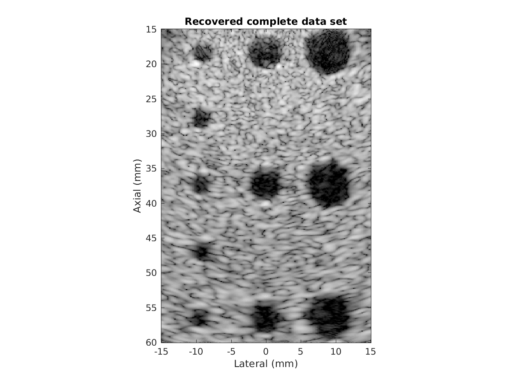
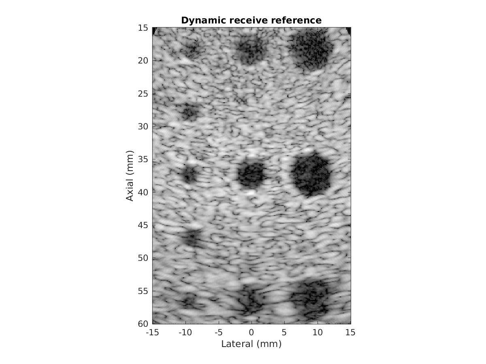

# Recovery of the complete data set

Decode a set of focused transmit ultrasound beams into the "complete data set", indexed by individual transmit elements and receive channels. This decoding has many benefits for image quality:
* Improved electronic signal-to-noise ratio
* Synthetic transmit focusing, providing diffraction-limited resolution at all depths
* Uniform field response from the recovered diverging waves (as opposed to focal gain at a fixed depth)
* Flexibility to apply transmit apodization, phase aberration correction, or other aperture-domain processing

This code is based on the algorithm proposed in:

> Bottenus, N. "Recovery of the complete data set from focused transmit beams". *IEEE Transactions on Ultrasonics, Ferroelectrics, and Frequency Control*. In review.

If you use the code/algorithm for research, please cite the above paper. For commercial use, please contact me at nick.bottenus@duke.edu to discuss the related IP.

# Sample results

Output of the sample code:

Dynamic receive (conventional) processing of the same data set for reference:

# The code

This repository provides both a MATLAB and Python implementation of the decoding method.

## MAT file
[sample_data.mat](./sample_data.mat) is saved in Matlab v7 format for compatibility with Python. This data was acquired using the Verasonics Vantage research scanner.
* __rf__ - RF channel data (samples x receive channels x transmit events)
* __transmit_delays__ - The applied focal delays (transmit events x elements)
* __params__:
  * c - Speed of sound
  * fs - Sampling frequency (Hz)
  * f0 - Transmit center frequency (Hz)
  * tx_pos - Array transmit position (x,y,z) (all zero)
  * rx_pos - Array element locations (x,y,z) (meters)
  * theta - Beam steering angles (degrees)
  * apex - Axial distance behind the array for the steered beams (meters)
  * focus - Transmit focal points relative to the array position (x,y,z) (meters)
  * t0 - Sample index of the first data point (negative indicates that recording started before transmission was finished)
  * samples - Number of axial samples in the data set

## MATLAB

Both the frequency domain and time domain algorithms are implemented in [decode_focused_beams.m](./decode_focused_beams.m).

See [demo.m](./demo.m) for an example of how to use the code with the provided sample experimental data. The provided demo code should run in several seconds on most modern computers.

## Python

The frequency domain algorithm is implemented in [decode_focused_beams.py](./decode_focused_beams.py) in the `decode(rf, delays)` function.

See the `main()` function for an example of how to use the code with the provided sample experimental data. The demo code can be run as `python decode_focused_beams.py`.
